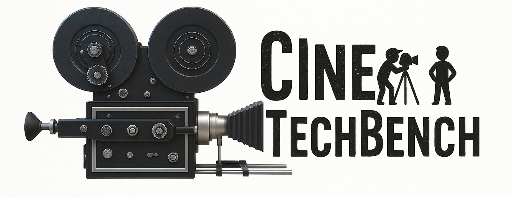
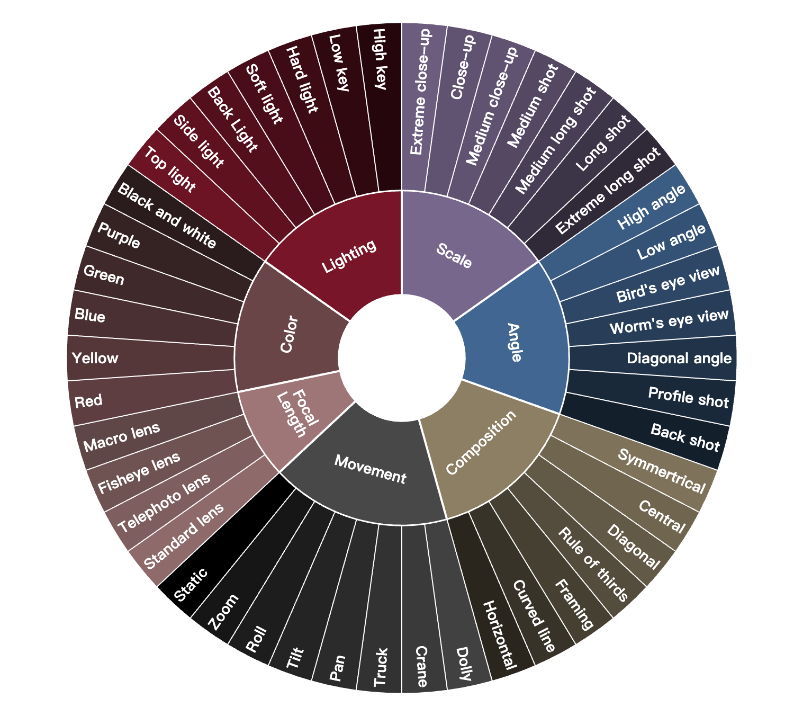
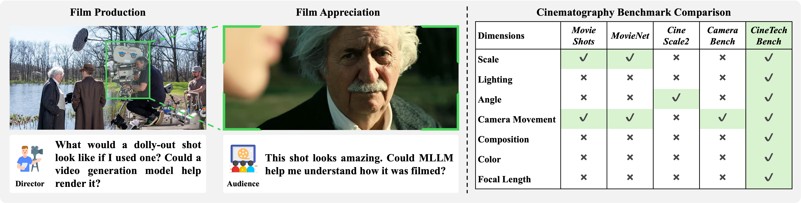

<p align="center" style="border-radius: 10px">
  
</p>

# 📽️ CineTechBench: A Benchmark for Cinematographic Technique Understanding and Generation

<div align="center">
<a href="https://pris-cv.github.io/CineTechBench/"></a> &ensp;
<a href="http://arxiv.org/abs/2505.15145"></a> &ensp;
<a href="https://www.alphaxiv.org/overview/2505.15145v1"></a> &ensp;
<a href="https://huggingface.co/datasets/Xinran0906/CineTechBench"></a> &ensp;
</div>


## 👀 Introduction
We present CineTechBench, a pioneering benchmark founded on precise, manual annotation by seasoned cinematography experts across key cinematography dimensions. Our benchmark covers seven essential aspects—shot scale, shot angle, composition, camera movement, lighting, color, and focal length—and includes over 600 annotated movie images and 120 movie clips with clear cinematographic techniques.


<div style="display: flex; align-items: center; justify-content: center; gap: 20px;">
<!--    -->
  
</div>


## 📌 TODO
- [x] Video extraction script for movie clips
- [x] Camera trajectory similarity calculation script
- [x] Movie image link organization and documentation
- [x] Video Question-answering evaluation script
- [ ] Image Question-answering evaluation script
- [ ] Description evaluation script


## Prepare Benchmark
Due to the copyright, we cannot distributed the movie clips and images directly, here we provide [instructions](dataset/README.md) to download and preprocess the data in our benchmark. We upload the all image links in `image_annotation` file in our [CineTechBench HF Repo](https://huggingface.co/datasets/Xinran0906/CineTechBench).


## 💾 Environment

Create the conda environment:
```bash
conda create -n ctbench python=3.11 -y
conda activate ctbench
```

Install pytorch (e.g, cuda 12.4) and transformers
```
pip install torch==2.5.0 torchvision==0.20.0 torchaudio==2.5.0 --index-url https://download.pytorch.org/whl/cu124
pip install transformers==4.51.3
```

Install flash-attn
```
pip install flash-attn
```

Please prepare another conda environment following the instruction in [MonST3R](https://monst3r-project.github.io/) for estimating camera trajectory from input video.


## 📊 Evaluation

**Camera Movement Question Answering**

We provide an example to evaluate Gemini. Please set following paths in `eval/video_qa_gemini-2.5-pro.py` and then run it to evaluate.
```
JSON_DATA_PATH = r""
VIDEO_FOLDER_PATH = r""
```

**Camera Movement Generation**

Before evaluation, you should first prepare the generated videos and the original film clips. Then use [MonST3R](https://monst3r-project.github.io/) to estimate their camera trajectory. The result folder should be arranged like:

```text
- original_clips
  - result for movie clip 1 
  - result for movie clip 2
- wani2v_ct
  - result for generated movie clip 1 
  - result for generated movie clip 2
```

After preparing the camera trajectory estimation results, please use `eval/eval_ct.sh` to summary the results.


## 💽 Copyright
We fully respect the copyright of all films and do not use any clips for commercial purposes. Instead of distributing or hosting video content, we only provide links to publicly available, authorized sources (e.g., official studio or distributor channels). All assets are credited to their original rights holders, and our use of these links falls under fair‐use provisions for non‐commercial, academic research.


## 🤗 Acknowledgements
We would like to thank the contributors to the [Wan2.1](https://github.com/Wan-Video/Wan2.1), [FramePack](https://github.com/lllyasviel/FramePack), [CamI2V](https://github.com/ZGCTroy/CamI2V), [vLLM](https://github.com/vllm-project/vllm), [SGLang](https://github.com/sgl-project/sglang), [LMDeploy](https://github.com/InternLM/lmdeploy), [HunyuanVideo](https://github.com/Tencent/HunyuanVideo), [HunyuanVideo-I2V](https://github.com/Tencent/HunyuanVideo-I2V), [MovieNet](https://movienet.github.io/#), [SkyReels-V2](https://github.com/SkyworkAI/SkyReels-V2), [MonST3R](https://monst3r-project.github.io/), [CAPability](https://capability-bench.github.io/) for their open research.

## 📮 Contant

If you have any question please feel free to mail to wangxr@bupt.edu.cn.


## 🔗 Citation
```Text
@misc{wang2025cinetechbenchbenchmarkcinematographictechnique,
      title={CineTechBench: A Benchmark for Cinematographic Technique Understanding and Generation}, 
      author={Xinran Wang and Songyu Xu and Xiangxuan Shan and Yuxuan Zhang and Muxi Diao and Xueyan Duan and Yanhua Huang and Kongming Liang and Zhanyu Ma},
      year={2025},
      eprint={2505.15145},
      archivePrefix={arXiv},
      primaryClass={cs.CV},
      url={https://arxiv.org/abs/2505.15145}, 
}
```


